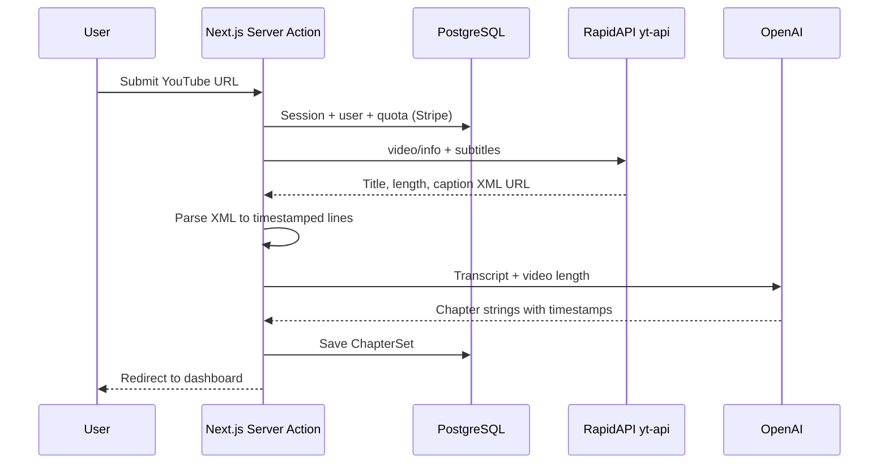

# YouTube to Chapters

A [Next.js](https://nextjs.org/) web app that turns YouTube watch URLs into chapter timestamps you can paste into your video description. It pulls captions via a third-party YouTube API, sends the transcript to OpenAI to propose natural breakpoints, and stores each run in your account so you can copy or manage it from the dashboard.

---

## What it does

1. **Sign in** with Google or Discord (NextAuth.js + Prisma).
2. **Paste a YouTube link** on the generate page (`/generate-chapters`).
3. The app **fetches video metadata and subtitles**, parses the caption XML, and **asks GPT-4o** for timestamped chapter lines in the form `[mm:ss] Chapter title`.
4. The result is **saved** as a `ChapterSet` tied to your user and listed on **`/dashboard`**, where you can copy text and optionally delete past generations.

**Usage limits (enforced in code):**

| Tier | Generations | Window |
|------|-------------|--------|
| Free | 5 | Calendar month |
| Pro (Stripe subscription) | 40 | Current Stripe billing period |

**Other limits:**

- Videos must be **at most 1 hour** (`3600` seconds).
- The video must have **usable subtitles/captions** returned by the API; without them, generation fails.

---

## Tech stack

- **Framework:** Next.js 14 (App Router), React 18, TypeScript
- **Auth:** NextAuth.js with Google and Discord providers, Prisma adapter
- **Database:** PostgreSQL via Prisma
- **Payments:** Stripe (subscription checkout + customer portal)
- **AI:** OpenAI Chat Completions (structured output with Zod), model `gpt-4o-2024-08-06`
- **YouTube data:** [RapidAPI — yt-api](https://rapidapi.com/) (`yt-api.p.rapidapi.com`) for `video/info` and `subtitles`
- **UI:** Tailwind CSS, Radix UI primitives, Lucide icons

---

## Prerequisites

- **Node.js** (18+ recommended; matches typical Next 14 requirements)
- **PostgreSQL** database reachable via `DATABASE_URL`
- Accounts / API keys for:
  - Google Cloud OAuth (or Discord application)
  - [RapidAPI](https://rapidapi.com/) subscription to the yt-api product
  - [OpenAI](https://platform.openai.com/) API
  - [Stripe](https://stripe.com/) (test or live) with a **recurring Price** for checkout

---

## Environment variables

Create a `.env` file in the project root (do not commit secrets). The application expects:

| Variable | Purpose |
|----------|---------|
| `DATABASE_URL` | PostgreSQL connection string for Prisma |
| `NEXTAUTH_URL` | Public base URL of the app (e.g. `http://localhost:3000` in dev) |
| `SECRET` | NextAuth session encryption secret |
| `GOOGLE_CLIENT_ID` | Google OAuth client ID |
| `GOOGLE_CLIENT_SECRET` | Google OAuth client secret |
| `DISCORD_CLIENT_ID` | Discord OAuth client ID |
| `DISCORD_CLIENT_SECRET` | Discord OAuth client secret |
| `RAPID_API_KEY` | RapidAPI key for `yt-api.p.rapidapi.com` |
| `OPENAI_API_KEY` | OpenAI API key |
| `STRIPE_SECRET_KEY` | Stripe secret key |
| `PRICE_KEY` | Stripe **Price ID** (subscription) used in checkout |

**OAuth redirect URLs** (add these in each provider’s console):

- Google: `{NEXTAUTH_URL}/api/auth/callback/google`
- Discord: `{NEXTAUTH_URL}/api/auth/callback/discord`

---

## Local setup

1. **Clone and install dependencies**

   ```bash
   git clone <your-repo-url>
   cd Youtube-to-Chapters
   npm install
   ```

   `postinstall` runs `prisma generate` automatically.

2. **Configure environment**

   Copy your variables into `.env` as described above.

3. **Create the database schema**

   The repo includes a Prisma schema but no checked-in migration folder. For local development you can push the schema:

   ```bash
   npx prisma db push
   ```

   For production, prefer `prisma migrate dev` / `prisma migrate deploy` once you add migrations.

4. **Run the dev server**

   ```bash
   npm run dev
   ```

   Open [http://localhost:3000](http://localhost:3000).

5. **Production build**

   ```bash
   npm run build
   npm start
   ```

---

## NPM scripts

| Script | Description |
|--------|-------------|
| `npm run dev` | Next.js development server |
| `npm run build` | Production build |
| `npm run start` | Start production server |
| `npm run lint` | ESLint (Next.js config) |

---

## Project structure (high level)

```
app/
  page.tsx                 # Marketing home
  signin/                  # OAuth sign-in
  generate-chapters/       # URL input + server action for generation
  dashboard/               # Saved chapters, Stripe links, usage messaging
  pricing/                 # Plans and limits
  api/auth/[...nextauth]/  # NextAuth route handler
lib/
  auth.ts                  # NextAuth options (providers, adapter)
  prisma.ts                # Prisma client singleton
utils/
  youtube.ts               # RapidAPI YouTube client
  parsing.ts               # Caption XML → timed text
  openai.ts                # Chapter generation via OpenAI
  stripe.ts                # Subscription checks, checkout, limits
  validation.ts            # YouTube URL validation
prisma/
  schema.prisma            # User, Account, Session, ChapterSet, etc.
components/                # UI (navbar, chapters list, shadcn-style pieces)
```

---

## How generation works



Supported URL shapes are validated in code: standard `youtube.com/watch?v=...` and short `youtu.be/...` links with an 11-character video ID.

---

## Stripe notes

- Checkout and portal URLs use `NEXTAUTH_URL` (see `utils/stripe.ts`).
- New users get a Stripe customer created on first dashboard visit when missing (`createCustomerIfNull`).
- Ensure the **Customer portal** is configured in Stripe for your account, and that `PRICE_KEY` matches a recurring price you intend to sell.
- The codebase may contain a hard-coded Stripe billing reference in the portal `return_url`; adjust that for your own Stripe test/live environment before shipping.

---

## Security and operations

- Never commit `.env` or real API keys.
- Rotate `SECRET` and provider secrets if they leak.
- RapidAPI and OpenAI usage are billed per their pricing; rate limits apply at the provider level.
- Caption availability and API behavior depend on the third-party YouTube wrapper, not the official YouTube Data API alone.

---

## Troubleshooting

| Symptom | Things to check |
|---------|------------------|
| “Authentication required” | Session expired; sign in again. |
| “Invalid link” | Use a standard watch or youtu.be URL with a valid video ID. |
| “Failed to get video details” | RapidAPI key, subscription, or network; video may block captions. |
| “Video length is too long” | Shorter than 1 hour only. |
| “Failed to generate chapters” | `OPENAI_API_KEY`, model access, or malformed transcript. |
| Prisma errors | `DATABASE_URL`, database running, schema pushed/migrated. |
| OAuth redirect mismatch | `NEXTAUTH_URL` and provider callback URLs must match exactly. |

---

## License

This project is private (`"private": true` in `package.json`). Add a public license file here if you open-source the repository.
